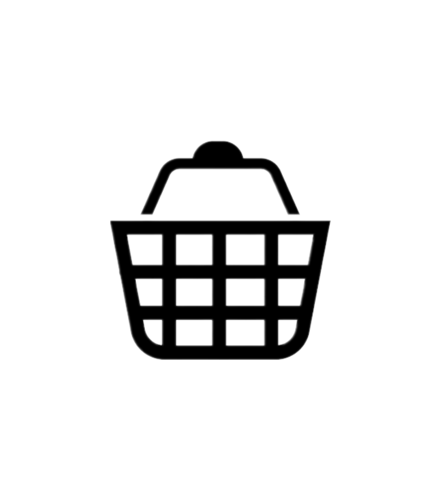

<html lang="en">
<head>
    <meta charset="UTF-8">
    <link rel="stylesheet" href="sent.css">
    <title>VINTAGE COLLECTION</title>
    <link rel="stylesheet" href="https://stackpath.bootstrapcdn.com/font-awesome/4.7.0/css/font-awesome.min.css">
</head>
<body>

    

        

            

                
    
    
            

             <nav>
                <ul id="MenuItems">
                    <li><a href="">Home</a></li>
                    <li><a href="">Product</a></li>
                    <li><a href="">About</a></li>
                    <li><a href="">Contact</a></li>
                    <li><a href="">Account</a></li>
                </ul>
             </nav>
             
             
        

        

            

                <h1>Give Your Workout A New Style</h1>
                
Success isn't always about greatness. It's about
                consistency. Consistent hard work gains success. Greatness
                will come.

                <a href="" class="btn">Explore Now &#8594;</a>
            

            

                
            

        

    

<!------ featured catergories ------>
    

        

            

                

                    
                

                

                    
                

                

                    
                

            

        

       
    

<!------ featured products ------>
    

        <h2 class="title">Featured Products</h2>
        

            

                
                <h4>Red Printed T-Shirt</h4>
                

                    <i class="fa fa-star"></i>
                    <i class="fa fa-star"></i>
                    <i class="fa fa-star"></i>
                    <i class="fa fa-star"></i>
                    <i class="fa fa-star-o"></i>
                

                
$50.00

            

            

                
                <h4>Red Printed T-Shirt</h4>
                

                    <i class="fa fa-star"></i>
                    <i class="fa fa-star"></i>
                    <i class="fa fa-star"></i>
                    <i class="fa fa-star-half-o"></i>
                    <i class="fa fa-star-o"></i>
                

                
$50.00

            

            

                
                <h4>Red Printed T-Shirt</h4>
                

                    <i class="fa fa-star"></i>
                    <i class="fa fa-star"></i>
                    <i class="fa fa-star"></i>
                    <i class="fa fa-star"></i>
                    <i class="fa fa-star-half-o"></i>
                

                
$50.00

            

            

                
                <h4>Red Printed T-Shirt</h4>
                

                    <i class="fa fa-star"></i>
                    <i class="fa fa-star"></i>
                    <i class="fa fa-star"></i>
                    <i class="fa fa-star"></i>
                    <i class="fa fa-star-o"></i>
                

                
$50.00

            

        

        <h2 class="title">Latest Products</h2>
        

            

                
                <h4>Red Printed T-Shirt</h4>
                

                    <i class="fa fa-star"></i>
                    <i class="fa fa-star"></i>
                    <i class="fa fa-star"></i>
                    <i class="fa fa-star"></i>
                    <i class="fa fa-star-o"></i>
                

                
$50.00

            

            

                
                <h4>Red Printed T-Shirt</h4>
                

                    <i class="fa fa-star"></i>
                    <i class="fa fa-star"></i>
                    <i class="fa fa-star"></i>
                    <i class="fa fa-star-half-o"></i>
                    <i class="fa fa-star-o"></i>
                

                
$50.00

            

            

                
                <h4>Red Printed T-Shirt</h4>
                

                    <i class="fa fa-star"></i>
                    <i class="fa fa-star"></i>
                    <i class="fa fa-star"></i>
                    <i class="fa fa-star"></i>
                    <i class="fa fa-star-half-o"></i>
                

                
$50.00

            

            

                
                <h4>Red Printed T-Shirt</h4>
                

                    <i class="fa fa-star"></i>
                    <i class="fa fa-star"></i>
                    <i class="fa fa-star"></i>
                    <i class="fa fa-star"></i>
                    <i class="fa fa-star-o"></i>
                

                
$50.00
 
            

            

                
                <h4>Red Printed T-Shirt</h4>
                

                    <i class="fa fa-star"></i>
                    <i class="fa fa-star"></i>
                    <i class="fa fa-star"></i>
                    <i class="fa fa-star"></i>
                    <i class="fa fa-star-o"></i>
                

                
$50.00
 
            

            

                
                <h4>Red Printed T-Shirt</h4>
                

                    <i class="fa fa-star"></i>
                    <i class="fa fa-star"></i>
                    <i class="fa fa-star"></i>
                    <i class="fa fa-star"></i>
                    <i class="fa fa-star-o"></i>
                

                
$50.00
 
            

            

                
                <h4>Red Printed T-Shirt</h4>
                

                    <i class="fa fa-star"></i>
                    <i class="fa fa-star"></i>
                    <i class="fa fa-star"></i>
                    <i class="fa fa-star"></i>
                    <i class="fa fa-star-o"></i>
                

                
$50.00
 
            

            

                
                <h4>Red Printed T-Shirt</h4>
                

                    <i class="fa fa-star"></i>
                    <i class="fa fa-star"></i>
                    <i class="fa fa-star"></i>
                    <i class="fa fa-star"></i>
                    <i class="fa fa-star-o"></i>
                

                
$50.00
 
            

        

    

<!------ offer ------>
    

        

            

                

                    
                

                

                    

                    
Exclusively Available on Vintage Collection

                    <h1>Smart Band 4</h1>
                    <small>
                        The Mi Smart band 4 features a 39.9% larger 
                        (than Mi Band 3) AMOLED color full-touch display width
                        adjustable brightness, so everything is clear as can be.
                    </small>
                    

                    
<a href="">Buy Now &#8594;</a>

                

            

        

    

    <!------- testimonial ------->
    

        

            

                

                    <i class="fa fa-quote-left"></i>
                    
Lorem Ipsum is simply dummy text of printing
                        and typesetting industry. Lorem Ipsum has been the industry's standard dummy text ever

                        

                            <i class="fa fa-star"></i>
                            <i class="fa fa-star"></i>
                            <i class="fa fa-star"></i>
                            <i class="fa fa-star"></i>
                            <i class="fa fa-star-half-o"></i>
                        

                        
                        <h3>Sean Parker</h3>
                

                

                    

                    
Lorem Ipsum is simply dummy text of printing
                        and typesetting industry. Lorem Ipsum has been the industry's standard dummy text ever

                        

                            <i class="fa fa-star"></i>
                            <i class="fa fa-star"></i>
                            <i class="fa fa-star"></i>
                            <i class="fa fa-star"></i>
                            <i class="fa fa-star-half-o"></i>
                        

                        
                        <h3>Mike Smith</h3>
                

                

                    <i class="fa fa-quote-left"></i>
                    
Lorem Ipsum is simply dummy text of printing
                        and typesetting industry. Lorem Ipsum has been the industry's standard dummy text ever

                        

                            <i class="fa fa-star"></i>
                            <i class="fa fa-star"></i>
                            <i class="fa fa-star"></i>
                            <i class="fa fa-star"></i>
                            <i class="fa fa-star-half-o"></i>
                        

                        
                        <h3>Mabel Joe</h3>
                

            

        

    

<!---------- brands---------->
    

        

            

                

                    
                

                

                    
                

                

                    
                

                

                    
                

                

                    
                

            

        

    

    <!------------- footer ---------->

    

        

            

                

                    <h3>Download Our App</h3>
                    
Download App for Android and ios mobile phone.

                    

                        
                        
                    

                

                

                    
                    
Our Purpose Is To Sustainably Make the Pleasure and
                    Benefits Of Sports Accessible to the Many. 

                

                

                    <h3>Useful Links</h3>
                    <ul>
                        <li>Coupons</li>
                        <li>Blog Post</li>
                        <li>Return Policy</li>
                        <li>Join Affiliate</li>
                    </ul>
                

                

                    <h3>Follow us</h3>
                    <ul>
                        <li>Facebook</li>
                        <li>Twitter</li>
                        <li>Instagram</li>
                        <li>YouTube</li>
                    </ul>
                

            

            

            
Copyright 2020 - Easy Tutorials

        

    

<!-------------js for toggle menu------------->
    
</body>
</html>

*{
    margin: 0;
    padding: 0;
    box-sizing: border-box;
}

body{
    font-family: 'Poppins', sans-serif;
}
.navbar{
    display: flex;
    align-items: center;
    padding: 20px;
}
nav{
    flex: 1;
    text-align: right;
}
nav ul{
    display: inline-block;
    list-style-type: none;
}
nav ul li{
    display: inline-block;
    margin-right: 20px;
}
a{
    text-decoration: none;
    color: #555;
}
p{
    color: #555;
}
.container{
    max-width: 1300px;
    margin: auto;
    padding-left: 25px;
    padding-right: 25px;
}
.row{
    display: flex;
    align-items: center;
    flex-wrap: wrap;
    justify-content: space-around;
}
.col-2{
    flex-basis: 50%;
    min-width: 300px;
}
.col-2 img{
    max-width: 100%;
    padding: 50px 0px;
}
.col-2 h1{
    font-size: 50px;
    line-height: 60px;
    margin: 25px 0px;
}
.btn{
    display: inline-block;
    background: #ff523b;
    color: #fff;
    padding: 8px 30px;
    margin: 30px 0;
    border-radius: 30px;
    transition: 0.5s;
}
.btn:hover{
    background: silver;
}
.header{
    background: radial-gradient(#fff,#ffd6d6);
}
.header .row{
    margin-top: 70px;
}
.categories{
    margin: 70px 0;
}
.col-3{
    flex-basis: 27%;
    min-width: 250px;
    margin-bottom: 30px;
}
.col-3 img{
    width: 100%;
}
.small-container{
    margin-top: 30px;
    max-width: 1080px;
    padding-left: 300px;
    padding-right: 25px;
}
.col-4{
    flex-basis: 25%;
    padding: 10px;
    min-width: 100px;
    margin-bottom: 50px;
    transition: transform 0.5s;
}
.col-4 img{
    width: 100%;
}

.title{
    text-align: center;
    margin: 0 auto 80px;
    position: relative;
    line-height: 60px;
    color: #555;
}
.title::after{
    content: '';
    background: #ff523b;
    width: 80px;
    height: 5px;
    border-radius: 5px;
    position: absolute;
    bottom: 0;
    left: 50%;
    transform: translateX(-50%);
}

h4{
    color: #555;
    font-weight: normal;
}
.col-4 p{
    font-size: 14px;
}

.rating .fa{
    color: #ff523b;
}

.col-4:hover{
    transform: translateY(-5px);
}
/*-------offer-------*/
.offer{
    background: radial-gradient(#fff,#ffd6d6);
    margin-top: 80px;
    padding: 30px 0;
}
.col-2 .offer-img{
    padding: 70px;
}
small{
    color: #555;
}

/*---------testimonial---------*/
.testimonial{
    padding-top: 100px;
}
.testimonial .col-3{
    text-align: center;
    padding: 40px 20px;
    box-shadow: 0 0 20px 0px rgba(0,0,0.1);
    cursor: pointer;
    transition: transform 0.5s;
}
.testimonial .col-3 img{
    width: 50px;
    margin-top: 20px;
    border-radius: 50%;
}
.testimonial .col-3:hover{
    transform: translateY(-10px);
}
.fa.fa-quote-left{
    font-size: 34px;
    color: #ff523b;
}
.col-3 p{
    font-size: 12px;
    margin: 12px;
    color: #777;
}

.testimonial .col-3 h3{
    font-weight: 600;
    color: #555;
    font-size: 16px;
}

/*---------brands--------*/
.brands{
    margin: 100px auto;
}
.col-5{
    width: 150px;
}
.col-5 img{
    width: 100%;
    cursor: pointer;
    filter: grayscale(100%);
}
.col-5 img:hover{
    filter: grayscale(0);
}
/*-----------footer-----------*/

.footer{
    background: rgb(0, 0, 0);
    color: white;
    font-size: 14px;
}
.footer p{
    color: white;
}
.footer h3{
    color: white;
    margin-bottom: 20px;
}
.footer-col-1, .footer-col-2, .footer-col-3, .footer-col-4{
    min-width: 250px;
    margin-bottom: 20px;
}
.footer-col-1{
    flex-basis: 30%;
}
.footer-col-2{
    flex: 1;
    text-align: center;
}
.footer-col-2 img{
    width: 180px;
    margin-bottom: 20px;
}
.footer-col-3, .footer-col-4{
    flex-basis: 12%;
    text-align: center;
}
ul{
    list-style-type: none;
}
.app-logo{
    margin-top: 20px;
}
.app-logo img{
    width: 140px;
}
.footer hr{
    border: none;
    background: #b5b5b5;
    height: 1px;
    margin: 20px 0;
}
.copyright{
    text-align: center;
}

.menu-icon{
    width: 38px;
    margin-left: 20px;
}
/*------------------- media query for menu -------------------*/

@media only screen and (max-width: 800px){
    nav ul{
        position: absolute;
        top: 70px;
        left: 0;
        background: #333;
        width: 100%;
        overflow: hidden;
        transition: max-height 0.5;
    }
    nav ul li{
        display: block;
        margin-right: 50px;
        margin-top: 10px;
        margin-bottom: 10px;
    }
    nav ul li a{
        color: #fff;
    }
    .menu-icon{
        display: block;
        cursor: pointer;
    }
}
/* ----------- all product page---------- */

.row-2{
    justify-content: space-between;
    margin: 100px auto 50px;
}
select{
    border: 1px solid #ff523b;
    padding: 5px;
}
select:focus{
    outline: none;
}
.page-btn{
    margin: 0 auto 80px;
}
.page-btn span{
    display: inline-block;
    border: 1px solid #ff523b;
    margin-left: 10px;
    width: 40px;
    height: 40px;
    text-align: center;
    line-height: 40px;
    cursor: pointer;
}
.page-btn span:hover{
    background: #ff523b;
    color: white;
}

/* -------- cart items ------- */

.cart-page{
    margin: 80px auto;
}
table{
    width: 100%;
    border-collapse: collapse;
}
.cart-info{
    display: flex;
    flex-wrap: wrap;
}
th{
    text-align: left;
    padding: 5px;
    color: #fff;
    background: #ff523b;
    font-weight: normal;
}

td{
    padding: 10px 5px;
}
td input{
    width: 40px;
    height: 30px;
    padding: 5px;
}
td a{
    color: #ff523b;
    font-size: 12px;
}
td img{
    width: 60px;
    height: 70px;
    margin-right: 10px;
}

.total-price{
    display: flex;
    justify-content: flex-end;
}

.total-price table{
    border-top: 3px solid #ff523b;
    width: 200px;
    max-width: 400px;
}
td:last-child{
    text-align: right;
}
th:last-child{
    text-align: right;
}

/* ---media query for less than 600 screen size--- */
@media only screen and (max-width: 600px){
    .row{
        text-align: center;
    }
    .col-2, .col-3, .col-4{
        flex-basis: 100px;
    }

    .cart-info p{
        display: none;
    }
}
